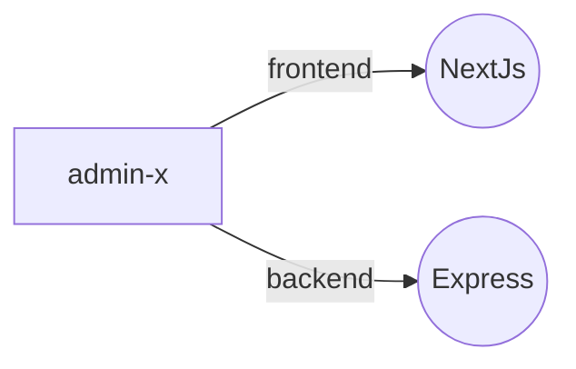

# --- AdminX---

O **AdminX** foi criado para servir como uma base de administração universal, podendo ser adaptado para diferentes tipos de negócios — barbearias, clínicas, salões de beleza, eventos e mais.

# Estrutura do Projeto



## Tecnologias Utilizadas

#### Frontend

- [x] Shadcn
- [x] NextJs / Ts
- [x] Tailwindcss

#### Backend

- [x] Express
- [x] MongoDB

## Como Executar o Projeto

```bash
git  clone  https://github.com/seu-usuario/adminx.git
cd  adminx

npm run dev:front
npm run dev:back
```

## Licença

    Este projeto está sob a licença MIT.

## Autor

Edgar Barbosa da Silva Junior
📧 [Email](01.edgarjunior@gmail.com) 🌐 [LinkedIn](https://www.linkedin.com/in/edgar-junior/)
