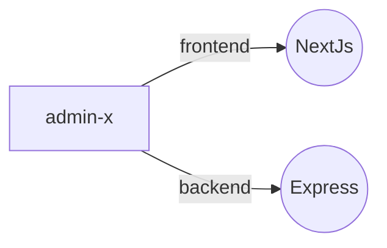

# --- AdminX---

O **AdminX** foi criado com o objetivo de organizar e controlar os problemas do dia a dia. A aplicação consiste em uma **API RESTful** construída com foco em escalabilidade e segurança, e um **frontend** simples que consome essa API para visualização e interação dos dados.

## Estrutura do Projeto



---

## Tecnologias Utilizadas

### Backend

> Dependências

- Node.js
- Express
- Mongoose
- JWT
- Zod
- cors
- bcryptjs
- dotenv

> Dependências de desenvolvimento

- @types/cors
- @types/express
- @types/jsonwebtoken
- @types/mongoose
- @types/node
- typescript

### Frontend

- Next.Js
- Axios
- Tailwindcss
- shadcn

---

## 📌 Funcionalidades Atuais

- [x] Autenticação
- [x] Usuário
- [x] Finanças

---

## 🛠️ Como Rodar o Projeto

### Backend

```bash
cd adminx-api
npm install
npm run dev
```

> Configuração necessária `adminx-api\src\config\env.ts`

### Frontend

```bash
cd adminx-web
npm install
npm run dev
```

> Configuração da porta `adminx-web\services\api.ts`

### ou na pasta Raiz

```bash
npm run dev:front
npm run dev:back
```

---

## 📌 Observações

Este projeto é de uso pessoal e está em constante evolução. Sinta-se à vontade para sugerir melhorias ou adaptar para suas próprias necessidades.

---

## 📄 Licença

Este projeto está sob a licença MIT.

---

## Autor

Edgar Barbosa da Silva Junior
📧 [Email](01.edgarjunior@gmail.com) 🌐 [LinkedIn](https://www.linkedin.com/in/edgar-junior/)
