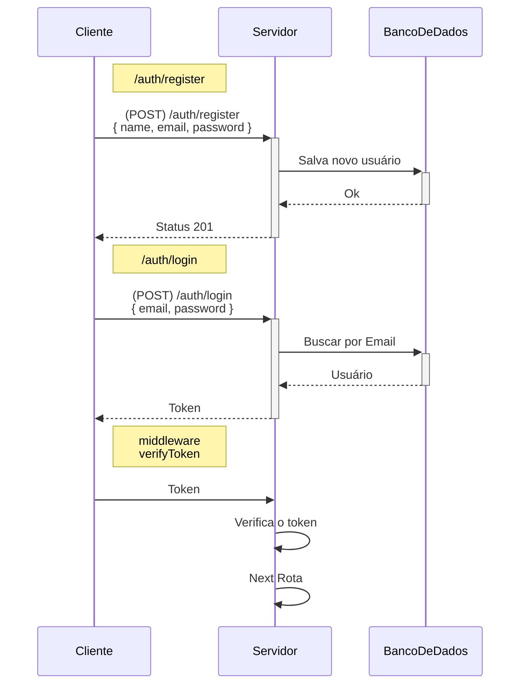
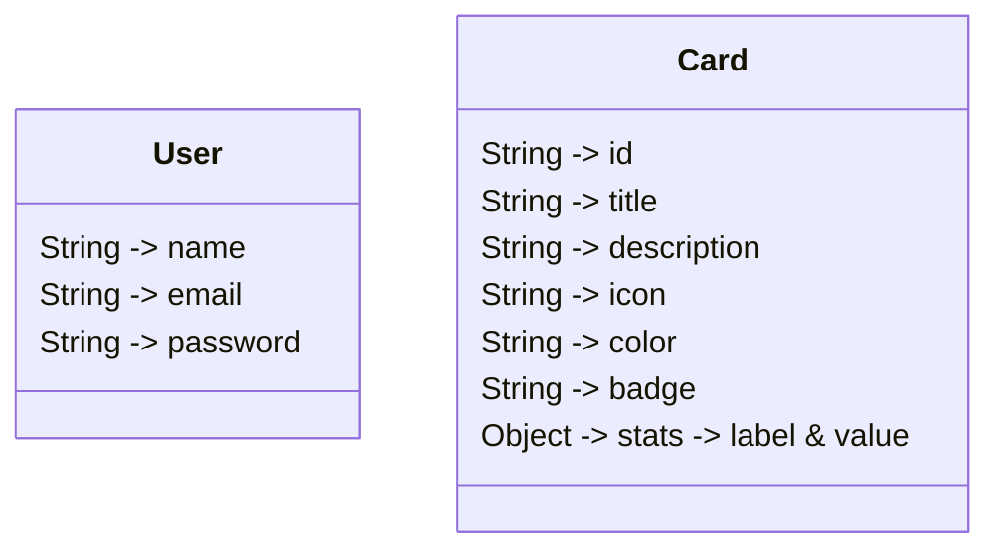

# ADMIN-X API RESTful

- [ADMIN-X API RESTful](#admin-x-api-restful) - [**Autenticação** (`Auth`)](#autenticação-auth) - [**Relações de modelo**](#relações-de-modelo)

---

### **Autenticação** (`Auth`)

| Método     | Rota             | Descrição                     |
| ---------- | ---------------- | ----------------------------- |
| POST       | `/auth/register` | Registro de novo usuário      |
| POST       | `/auth/login`    | Login e geração de token      |
| Middleware | `verifyToken`    | Verificar se o token é válido |

---

### **Usuário** (`User`)

| Método | Rota        | Descrição                  |
| ------ | ----------- | -------------------------- |
| GET    | `/user`     | Obter dados do usuário     |
| PUT    | `/user/:id` | Atualizar dados do usuário |
| DELETE | `/user/:id` | Deletar conta do usuário   |

---

### **Cards** (`Card`)

| Método | Rota        | Descrição                      |
| ------ | ----------- | ------------------------------ |
| GET    | `/card`     | Obter todas as funcionalidades |
| PUT    | `/card/:id` | Atualizar card                 |
| DELETE | `/card/:id` | Deletar card                   |

### **Relações de modelo**

